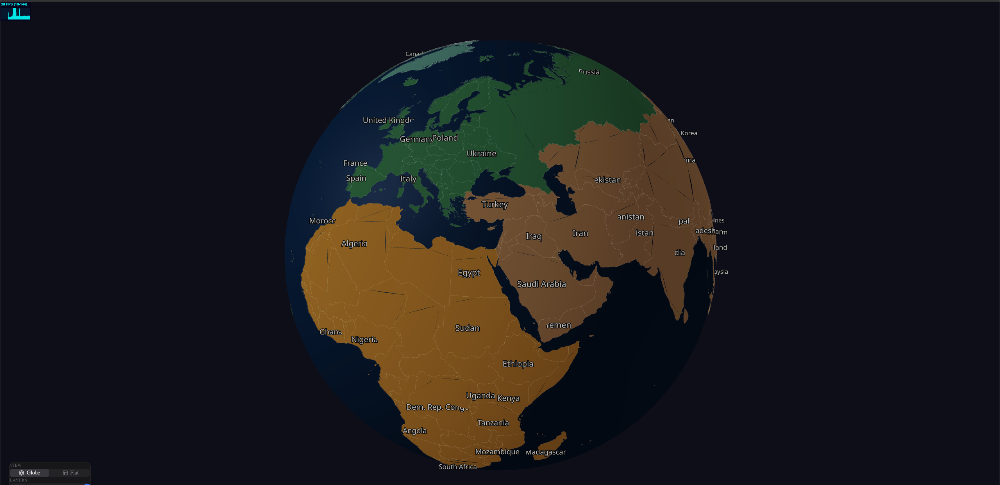
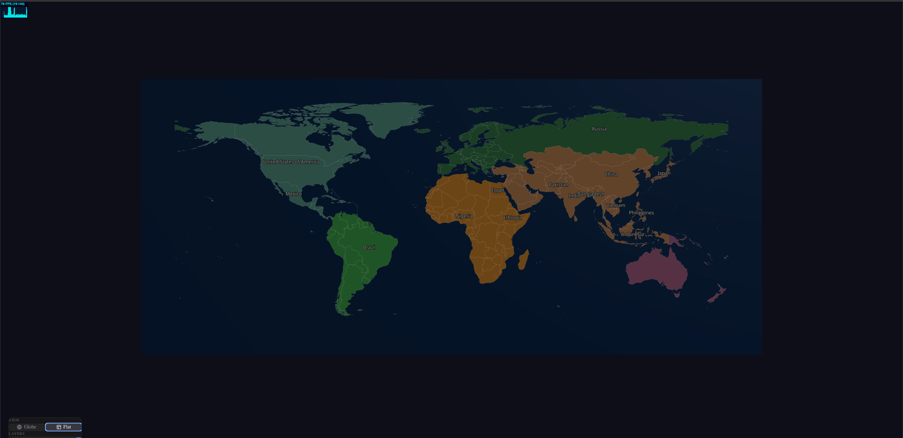
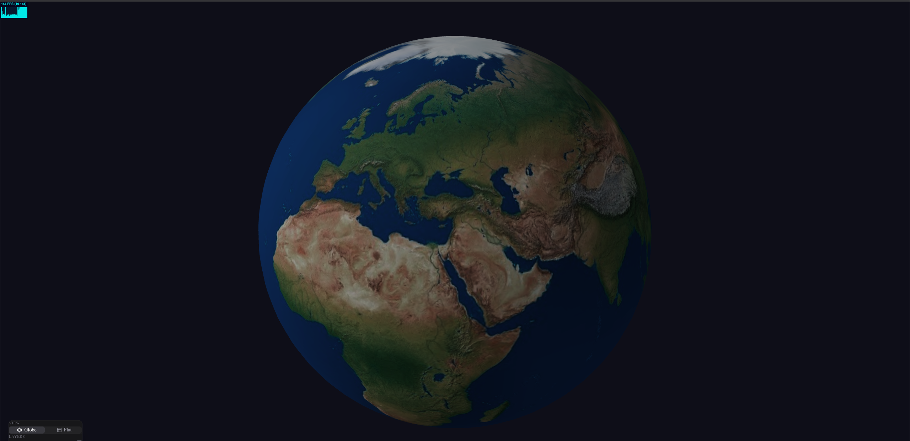

# The Geographies

Interactive 3D world map with morphable Globe/Flat projections built with Next.js, React Three Fiber, and Three.js.

 

## Screenshots

<p align="center">
  
</p>

<p align="center">
  
  
</p>

## Features

- **Morphable Projections**: Smooth GPU-accelerated transition between 3D globe and 2D flat map views
- **Interactive Countries**: Click on countries to view detailed information in a slide-out panel
- **Country Search**: Quick search by country name or ISO code with keyboard navigation
- **Multiple Layers**: Toggle between Political, Physical, Topography, Choropleth, and Heatmap layers
- **Topography Layer**: Hypsometric tint coloring with antialiased contour lines from elevation data
- **Data Visualization**: Choropleth maps for country data and heatmaps for intensity visualization
- **Day/Night Cycle**: Realistic day/night lighting with city lights, twilight glow, and atmosphere effects
- **16K Textures**: High-resolution NASA Blue Marble and Natural Earth imagery
- **Continent-based Coloring**: Warm color palette organized by continent
- **Modern Minimal UI**: Clean, Apple/Linear-inspired control panel
- **Responsive Controls**: Pan, zoom, and rotate with mouse/touch

## Tech Stack

- **Framework**: Next.js 16 with App Router
- **3D Rendering**: React Three Fiber + Three.js
- **Animations**: GSAP for smooth transitions
- **State Management**: Zustand
- **Styling**: Tailwind CSS 4
- **Language**: TypeScript

## Getting Started

### Prerequisites

- Node.js 18+
- pnpm (recommended) or npm

### Installation

```bash
# Clone the repository
git clone https://github.com/yourusername/the-geographies.git
cd the-geographies

# Install dependencies
pnpm install

# Start development server
pnpm dev
```

Open [http://localhost:3000](http://localhost:3000) in your browser.

### Build for Production

```bash
pnpm build
pnpm start
```

## Project Structure

```
src/
├── app/                    # Next.js App Router
├── components/
│   ├── canvas/            # 3D components (Globe, CountryMesh, etc.)
│   ├── ui/                # UI components (ControlPanel, CountryPanel, CountrySearch)
│   └── visualization/     # Data visualization (HeatmapLayer, Legend)
├── lib/
│   ├── geo/               # Geographic utilities (projections, morphing)
│   └── visualization/     # Visualization utilities (color scales, heatmap kernel)
├── store/                 # Zustand state management
└── types/                 # TypeScript type definitions

public/
├── data/                  # GeoJSON country data (Natural Earth)
└── textures/              # 16K Earth textures (NASA Blue Marble, GEBCO, Natural Earth)
```

## Controls

- **Globe Mode**: Drag to rotate, scroll to zoom
- **Flat Mode**: Drag to pan, scroll to zoom
- **Click**: Select a country to view details
- **Search**: Type to find countries (top center), use arrow keys to navigate
- **Control Panel**: Switch views, toggle layers, and effects (bottom-left)

## Data Sources

- Country boundaries: [Natural Earth](https://www.naturalearthdata.com/) (50m resolution)
- Day map texture: [NASA Blue Marble](https://visibleearth.nasa.gov/) (16K)
- Elevation data: [GEBCO](https://www.gebco.net/) via NASA (16K)
- Hypsometric tint: [Natural Earth](https://www.naturalearthdata.com/) (16K)

## License

MIT

## Roadmap

- [x] Day/night cycle animation
- [x] Country search functionality
- [x] Data visualization overlays (Choropleth & Heatmap)
- [x] Topography layer with hypsometric tint and contour lines
- [x] 16K texture upgrade (NASA Blue Marble, GEBCO, Natural Earth)
- [x] Flat mode rendering fixes (smooth globe↔flat transitions)
- [ ] Mobile touch optimizations
