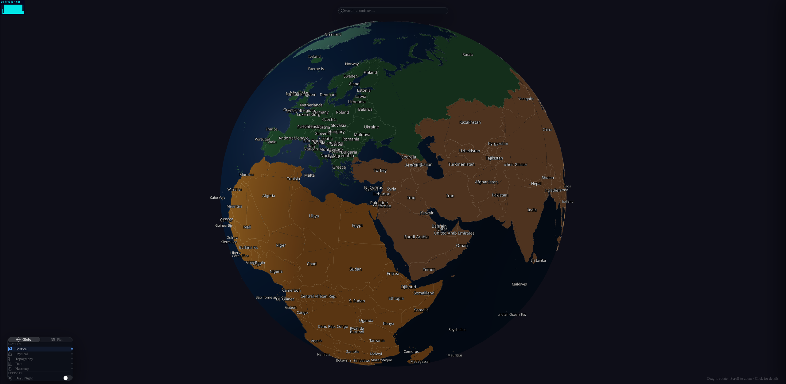
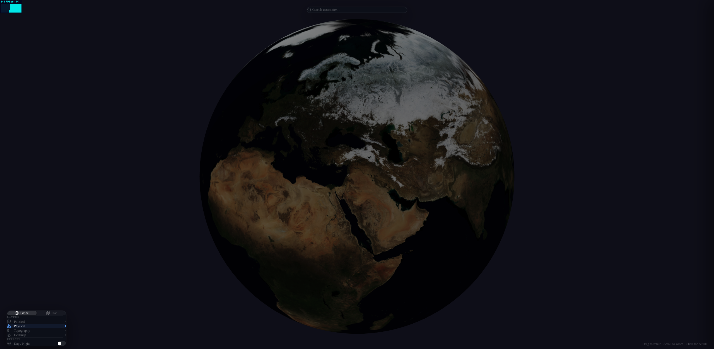
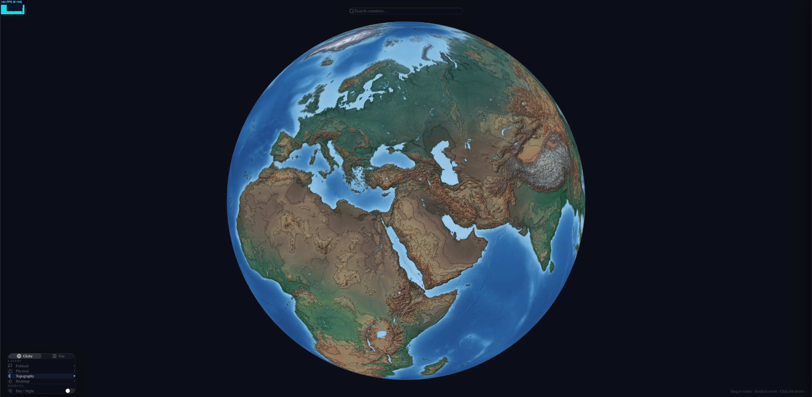
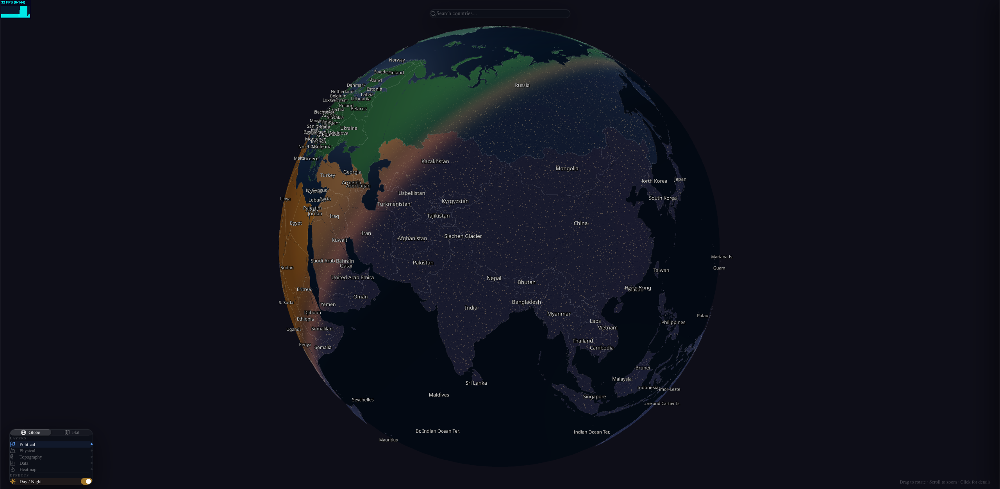
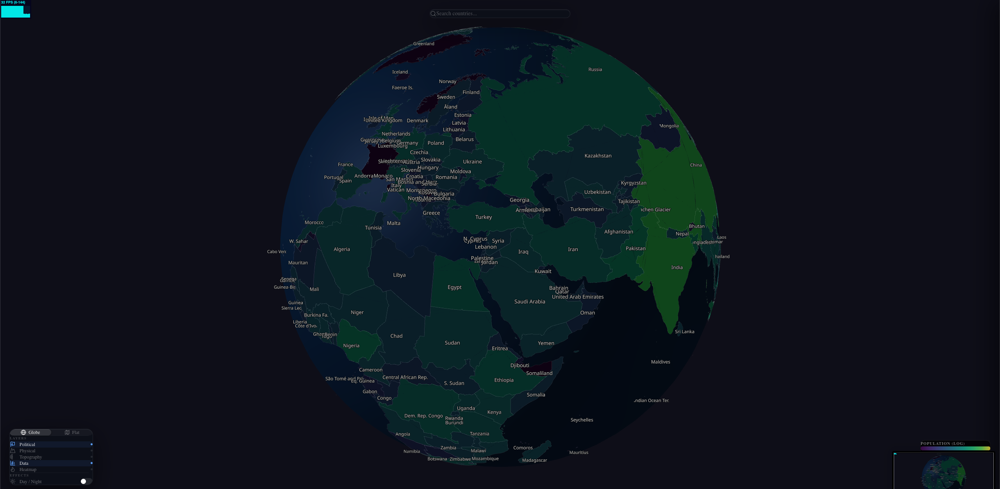
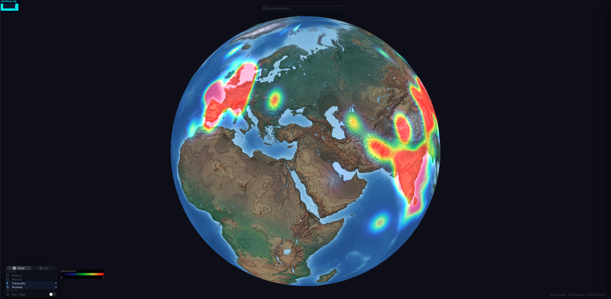

# The Geographies

Interactive 3D world map with morphable Globe/Flat projections built with Next.js, React Three Fiber, and Three.js.

 

## Screenshots

<p align="center">
  
</p>

<p align="center">
  
  
</p>

<p align="center">
  
  
</p>

<p align="center">
  
</p>

## Features

- **Morphable Projections**: Smooth GPU-accelerated transition between 3D globe and 2D flat map views
- **Interactive Countries**: Click on countries to view detailed information in a glass-morphism slide-out panel
- **Country Search**: Quick search by country name or ISO code with keyboard navigation and animated focus ring
- **Multiple Layers**: Toggle between Political, Physical, Topography, Choropleth, and Heatmap layers
- **Topography Layer**: Hypsometric tint coloring with antialiased contour lines from elevation data
- **Data Visualization**: Choropleth maps for country data and heatmaps with Gaussian kernel density
- **Real Sun Position**: The terminator follows the actual subsolar point for the current UTC time (solar ephemeris), with optional time-lapse via `timeScale`
- **Night Lights**: NASA Black Marble city lights on the night side of both the Physical and Political layers
- **Atmosphere & Ocean**: Sun-aware atmospheric glow (blue by day, orange at the terminator), ocean sun glint with Fresnel sky reflection, and a starfield
- **16K Textures, streamed**: NASA Blue Marble and Natural Earth imagery as GPU-compressed KTX2, loaded progressively (2K preview → 4K/8K device tier → 16K when zoomed in on desktop)
- **Continent-based Coloring**: Warm color palette organized by continent, echoed in panel avatar and search results
- **Glass Morphism UI**: Deep-blur panels with layered shadows, accent bars, and focus-ring animations
- **Responsive Controls**: Pan, zoom, and rotate with mouse/touch

## Tech Stack

- **Framework**: Next.js 16 with App Router
- **3D Rendering**: React Three Fiber + Three.js
- **Animations**: GSAP for smooth transitions
- **State Management**: Zustand
- **Styling**: Tailwind CSS 4
- **Language**: TypeScript
- **Linting**: ESLint 9 + [@batuhan-bas/configs](https://github.com/batuhan-bas/my-configs) (base TS + React rules)
- **Formatting**: Prettier 3 + [@batuhan-bas/configs](https://github.com/batuhan-bas/my-configs)

## Getting Started

### Prerequisites

- Node.js 18+
- pnpm (recommended) or npm

### Installation

```bash
# Clone the repository
git clone https://github.com/yourusername/the-geographies.git
cd the-geographies

# Install dependencies
pnpm install

# Start development server
pnpm dev
```

Open [http://localhost:3000](http://localhost:3000) in your browser.

### Build for Production

```bash
pnpm build
pnpm start
```

### Linting & Formatting

```bash
pnpm lint              # ESLint
pnpm format            # Prettier — write
pnpm format:check      # Prettier — check only
```

### Rebuilding Country Geometry

Country polygons are triangulated at build time (earcut with holes, crack-free curvature subdivision) and shipped as quantized, delta-encoded binary buffers, so the browser never triangulates.

```bash
pnpm geometry          # assets/geo-src/*.geojson → public/data/countries.{json,bin}
```

### Rebuilding Textures

Source images live in `assets/textures-src/` (not deployed). `pnpm textures` builds the KTX2 tiers into `public/textures/` (Basis ETC1S for color maps, zstd-compressed R8 for elevation). It requires [`toktx`](https://github.com/KhronosGroup/KTX-Software/releases) (KTX-Software ≥ 4.3) on `PATH`, or set `TOKTX=/path/to/toktx`.

```bash
pnpm textures          # build missing/outdated tiers
pnpm textures --force  # rebuild all tiers
```

## Project Structure

```
src/
├── app/                    # Next.js App Router
├── components/
│   ├── canvas/            # 3D components (Globe, CountriesLayer, CountryBorders, CountryLabels, ...)
│   ├── ui/                # UI components (ControlPanel, CountryPanel, CountrySearch)
│   └── visualization/     # Data visualization (HeatmapLayer, Legend)
├── lib/
│   ├── geo/               # Geographic utilities (projections, morphing, merged geometry)
│   ├── textures/          # KTX2 loading + progressive resolution tiers
│   └── visualization/     # Visualization utilities (color scales, heatmap kernel)
├── store/                 # Zustand state management
└── types/                 # TypeScript type definitions

assets/geo-src/            # Natural Earth 50m admin-0 GeoJSON (source)
assets/textures-src/       # 16K source images (NASA Blue Marble, GEBCO, Natural Earth)
scripts/build-geometry.mjs # GeoJSON → triangulated, quantized binary geometry
scripts/build-textures.mjs # Source images → KTX2 tiers

public/
├── basis/                 # Basis Universal transcoder (from three.js)
├── data/                  # Prebuilt country geometry (countries.json + countries.bin)
└── textures/              # KTX2 texture tiers (2K–16K)
```

## Controls

- **Globe Mode**: Drag to rotate, scroll to zoom
- **Flat Mode**: Drag to pan, scroll to zoom
- **Click**: Select a country to view details
- **Search**: Type to find countries (top center), use arrow keys to navigate
- **Control Panel**: Switch views, toggle layers, and effects (bottom-left)

## Data Sources

- Country boundaries: [Natural Earth](https://www.naturalearthdata.com/) (50m resolution)
- Day map texture: [NASA Blue Marble](https://visibleearth.nasa.gov/) (16K)
- Elevation data: [GEBCO](https://www.gebco.net/) via NASA (16K)
- Hypsometric tint: [Natural Earth](https://www.naturalearthdata.com/) (16K)
- Night lights: [NASA Black Marble 2016](https://earthobservatory.nasa.gov/features/NightLights) (13.5K)

## License

MIT

## Roadmap

- [x] Day/night cycle animation
- [x] Real-time sun position, Black Marble night lights, atmosphere glow, ocean glint
- [x] Country search functionality
- [x] Data visualization overlays (Choropleth & Heatmap)
- [x] Topography layer with hypsometric tint and contour lines
- [x] 16K texture upgrade (NASA Blue Marble, GEBCO, Natural Earth)
- [x] Flat mode rendering fixes (smooth globe-flat transitions)
- [x] Glass morphism UI (ControlPanel, CountrySearch, CountryPanel)
- [x] CountryPanel redesign (continent-colored avatar, GlassCard layout)
- [x] CountryLabels performance (ref-based, no per-frame setState)
- [x] Heatmap kernel fix (degree-space Gaussian with correct aspect ratio)
- [x] ESLint + Prettier setup ([@batuhan-bas/configs](https://github.com/batuhan-bas/my-configs))
- [ ] Mobile touch optimizations
- [x] Country border smooth morph animation
- [x] Progressive KTX2 texture loading (2K preview, device-aware tiers, 16K on zoom)
- [x] Single-draw-call countries, borders and labels with GPU picking and label collision
