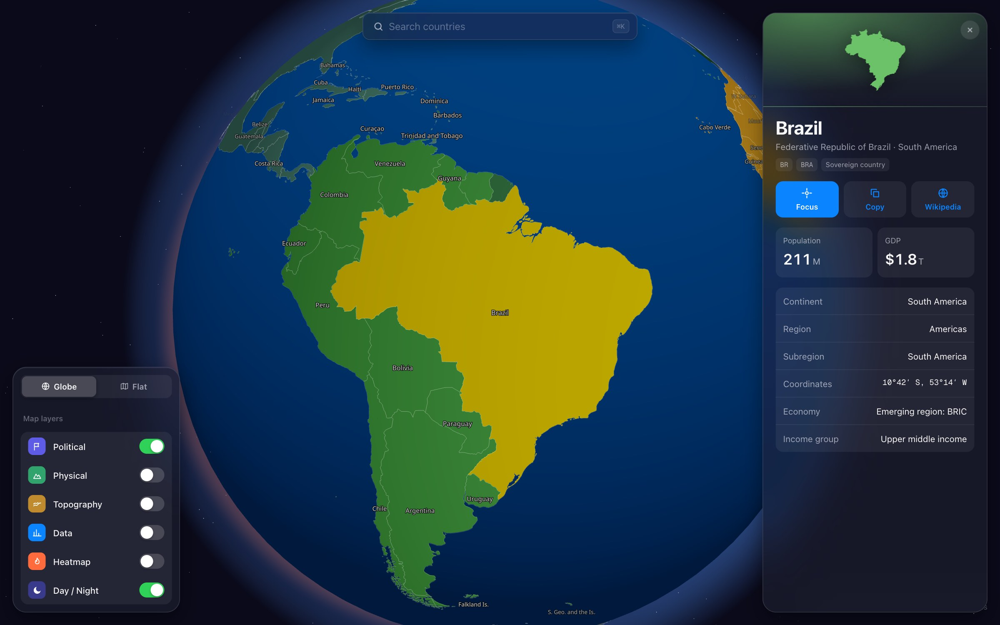
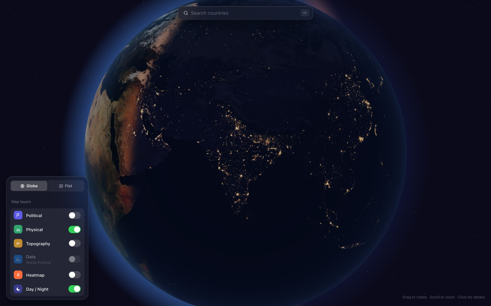
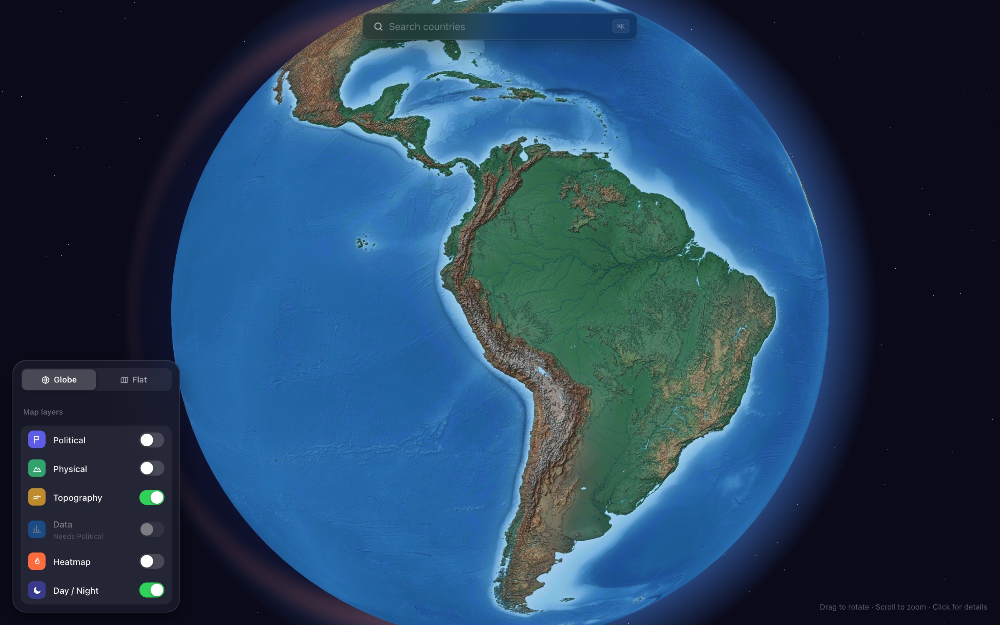
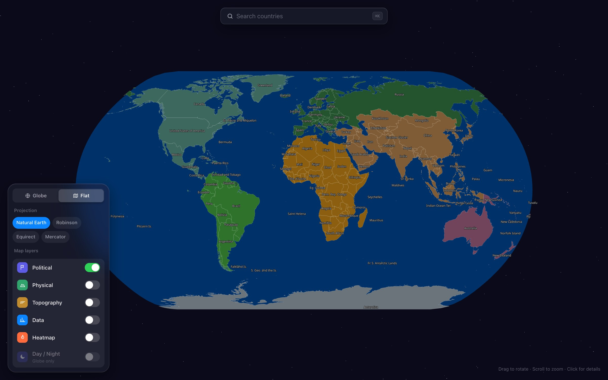
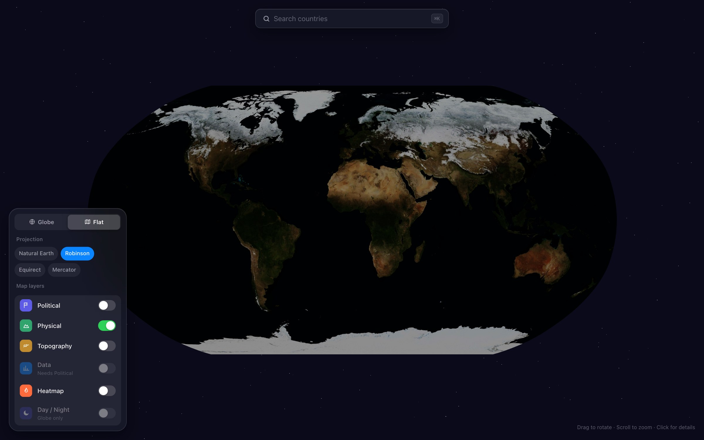
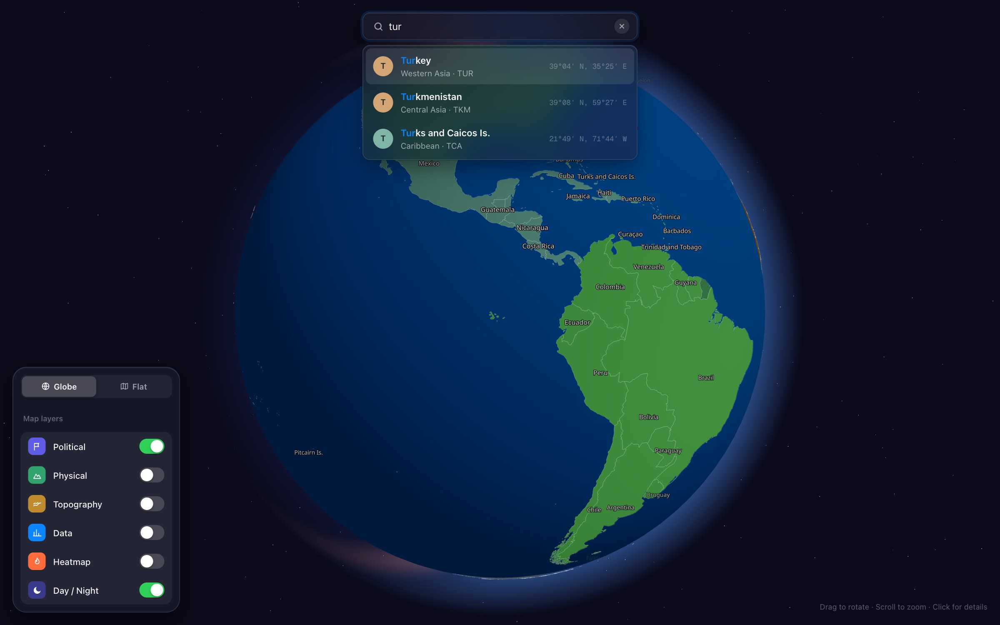
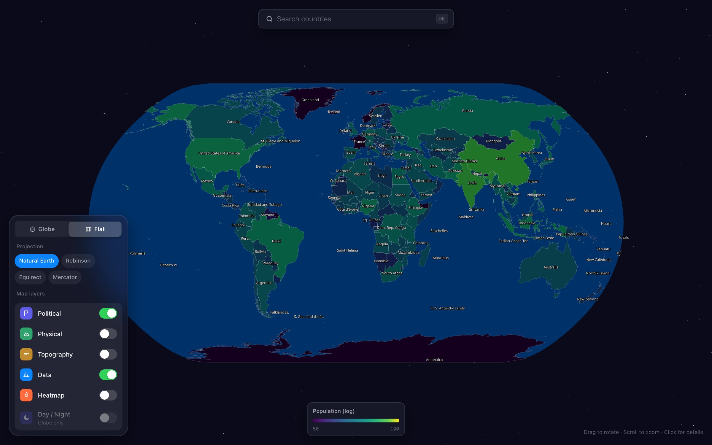
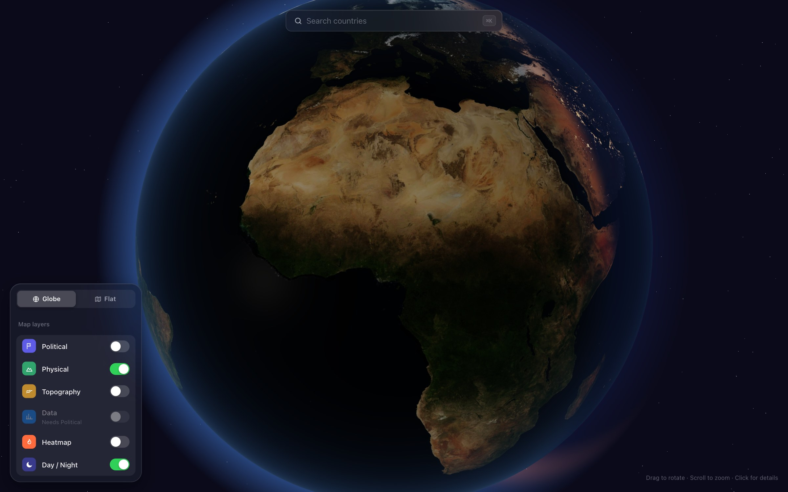
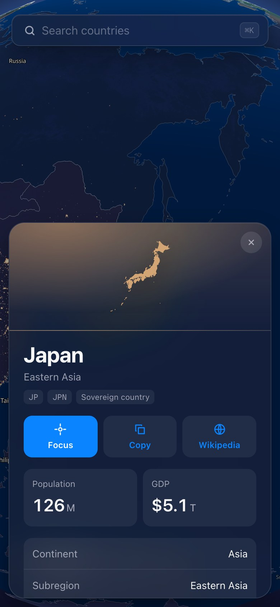

# The Geographies

An interactive 3D world map that morphs between a globe and four flat projections, lit by the real sun, with NASA night lights, a sun-aware atmosphere and an Apple Maps–style glass interface.

Built with Next.js, React Three Fiber and Three.js.

<p align="center">
  
</p>

<p align="center">
  
  
</p>

<p align="center">
  
  
</p>

<p align="center">
  
  
</p>

<p align="center">
  
  
</p>

## Features

### The map

- **Globe ⇄ flat morph** with four flat projections: **Natural Earth**, **Robinson**, **Equirectangular** and **Mercator**. Switching projections animates on the GPU without rebuilding any geometry; Antarctica is shown in the equal-area-style projections.
- **Real sun position**: the day/night terminator follows the actual subsolar point for the current UTC time.
- **Night lights** from NASA Black Marble on the night side of the Physical and Political layers.
- **Atmosphere and ocean**: a sun-aware glow (blue by day, orange at the terminator), ocean sun glint with Fresnel sky reflection, and a starfield.
- **Layers**: Political (continent colors), Physical (16K NASA Blue Marble), Topography (hypsometric tint + contour lines), population choropleth and a Gaussian heatmap.
- **Correct borders**: enclaves such as Lesotho in South Africa or San Marino and Vatican City in Italy are cut out of the surrounding country.
- **Readable labels**: country names are placed by population and never overlap.

### The interface

- **Search** by name or ISO code with ⌘K / `/`, arrow keys and Enter.
- **Country card** with the country's silhouette, population, GDP, region, coordinates and economy, plus Focus, Copy coordinates and Wikipedia actions.
- **Control panel** with a Globe/Flat switch, projection chips (flat mode only) and layer switches.
- **Dark glass design** inspired by Apple Maps, with spring animations that respect *reduce motion*. On phones the layers fold behind a button and the card becomes a bottom sheet.

### Performance

| | Before | After |
|---|---|---|
| Political layer draw calls | ~250 (one mesh per country) | 1 (merged mesh, GPU picking) |
| Borders | hundreds of line meshes | 1 draw call |
| Labels | ~250 meshes + per-label frame callbacks | 1 batched text draw, collision culling |
| Re-renders while the sun moves | whole scene, every frame | none (shared uniform) |
| Physical layer first download | 23.3 MB of 16K images | 0.24 MB preview, then 2.8 MB (8K) |
| Day map in GPU memory | ~700 MB (16K RGBA) | GPU-compressed KTX2 tiers |
| Country data | 1 MB GeoJSON (gzip), triangulated in the browser | 671 KB binary (gzip), prebuilt |

Textures load progressively: a 2K preview first, then the device's tier (8K on desktop, 4K on phones), and 16K only when you zoom in on desktop.

## Controls

| Action | Globe | Flat |
|---|---|---|
| Drag | Rotate | Pan |
| Scroll / pinch | Zoom | Zoom |
| Click a country | Open its card | Open its card |
| ⌘K or `/` | Search | Search |
| Esc | Close search or card | Close search or card |

## Getting started

Requires Node.js 20.9+ and pnpm.

```bash
git clone https://github.com/batuhan-bas/the-geographies.git
cd the-geographies
pnpm install
pnpm dev
```

Open the URL printed in the terminal (usually http://localhost:3000). Add `?stats` to the URL to show the FPS meter.

```bash
pnpm build && pnpm start   # production build
pnpm lint                  # ESLint
pnpm format                # Prettier
```

### Rebuilding the data

The country geometry and the textures are prebuilt and committed, so you only need these when you change the sources.

```bash
pnpm geometry          # assets/geo-src/*.geojson → public/data/countries.{json,bin}
pnpm textures          # assets/textures-src/* → public/textures/*.ktx2 (missing or outdated tiers)
pnpm textures --force  # rebuild every tier
```

- **Geometry**: polygons are triangulated with earcut (holes included), subdivided along great-circle edges without cracks, quantized and delta-encoded.
- **Textures**: Basis ETC1S for color maps and zstd-compressed R8 for elevation. Requires [`toktx`](https://github.com/KhronosGroup/KTX-Software/releases) (KTX-Software 4.3+) on your `PATH`, or `TOKTX=/path/to/toktx`.

## Tech stack

- **Framework**: Next.js 16 (App Router), React 19, TypeScript
- **3D**: React Three Fiber, Three.js, drei, troika-three-text
- **State**: Zustand
- **Animation**: GSAP and CSS springs
- **Styling**: Tailwind CSS 4, design tokens in [`MASTER.md`](MASTER.md)
- **Tooling**: ESLint 9 and Prettier 3 with [@batuhan-bas/configs](https://github.com/batuhan-bas/my-configs)

## Project structure

```
src/
├── app/                   # Next.js app, global tokens (globals.css)
├── components/
│   ├── canvas/            # Globe, CountriesLayer, CountryBorders, CountryLabels, Ocean, Physical, Topography
│   ├── effects/           # Atmosphere
│   ├── ui/                # CountrySearch, ControlPanel, CountryPanel
│   └── visualization/     # Heatmap layer, legends
├── lib/
│   ├── geo/               # Projections (CPU + GLSL), sun position, geometry, formatting
│   ├── textures/          # KTX2 loading and progressive tiers
│   └── visualization/     # Color scales, heatmap kernel
├── store/                 # Zustand stores
└── types/

assets/                    # Source GeoJSON and 16K images (not deployed)
scripts/                   # build-geometry.mjs, build-textures.mjs
public/
├── basis/                 # Basis Universal transcoder
├── data/                  # Prebuilt country geometry
└── textures/              # KTX2 texture tiers (2K–16K)
```

## Data sources

- Country boundaries: [Natural Earth](https://www.naturalearthdata.com/) admin-0, 1:50m
- Day map: [NASA Blue Marble](https://visibleearth.nasa.gov/)
- Night lights: [NASA Black Marble 2016](https://earthobservatory.nasa.gov/features/NightLights)
- Elevation: [GEBCO](https://www.gebco.net/) via NASA
- Hypsometric tint: [Natural Earth](https://www.naturalearthdata.com/)

## Roadmap

- [x] Merged, single-draw-call countries, borders and labels with GPU picking
- [x] Progressive KTX2 textures
- [x] Prebuilt geometry with enclaves and crack-free subdivision
- [x] Real sun, night lights, atmosphere and ocean glint
- [x] Natural Earth, Robinson, Equirectangular and Mercator projections
- [x] Apple Maps–style glass interface
- [ ] Capitals and city labels when zoomed in
- [ ] Time-of-day slider for the sun
- [ ] Touch gestures tuned for phones

## License

MIT
